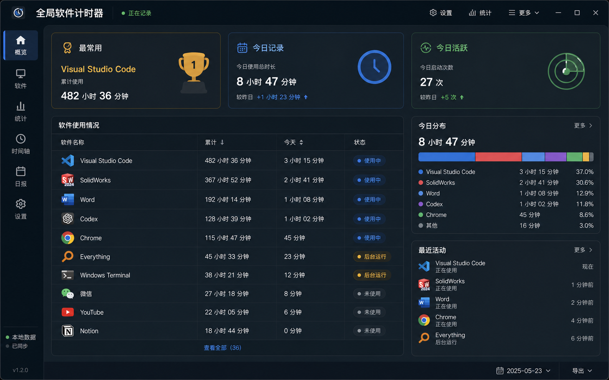

<div align="center">

# Global Software Timer

**全局软件计时器**

A Windows-first, local-first desktop tray app for tracking how long you use software.

一个 Windows 优先、本地优先的桌面状态栏软件，用来记录每个软件的运行时长。

<p>
  <a href="https://github.com/Awes0meE/Global-Software-Timer/releases/tag/v0.1.3">
    
  </a>
  
  
  <a href="./LICENSE">
    
  </a>
</p>

<p>
  
  
  
  
  
</p>

<p>
  <a href="#中文">中文</a>
  ·
  <a href="#english">English</a>
  ·
  <a href="https://github.com/Awes0meE/Global-Software-Timer/releases/tag/v0.1.3">Download</a>
  ·
  <a href="./PRIVACY.md">Privacy</a>
</p>

</div>

---

<a id="中文"></a>

## 中文

Global Software Timer（全局软件计时器）是一款本地优先的 Windows 桌面状态栏应用。它会在后台记录桌面软件的运行时长，并在仪表盘中以类似 Steam 游戏时长库的方式展示你的软件使用数据。

它适合想知道自己在 VS Code、浏览器、Office、设计工具、工程软件等桌面应用上投入了多少时间的人。v0.1.3 的重点是可靠、本地、隐私边界清晰、一个舒服的深色软件库式仪表盘、可直接修改的本机设置，以及可管理软件关注/隐藏状态的 `软件` 页面。



### 目录

- [中文](#中文)
  - [核心特性](#核心特性)
  - [下载安装](#下载安装)
  - [隐私边界](#隐私边界)
  - [技术架构](#技术架构)
  - [本地开发](#本地开发)
  - [项目结构](#项目结构)
  - [路线图](#路线图)
- [English](#english)
  - [Features](#features)
  - [Installation](#installation)
  - [Privacy Model](#privacy-model)
  - [Architecture](#architecture)
  - [Development](#development)
  - [Roadmap](#roadmap)
- [贡献](#贡献)
- [许可证](#许可证)

### 核心特性

- Windows 10/11 桌面状态栏应用。
- 后台记录软件运行时长，关闭仪表盘窗口后仍可继续运行。
- 本地 SQLite 存储，不需要账号，不上传数据。
- 自动识别常见用户软件，并默认过滤系统进程、驱动进程、更新助手、同步助手等噪声。
- 展示累计软件时长、今日记录时长、今日活跃时长、最常用软件和今日分布。
- 深色 Steam-like 软件库风格仪表盘。
- `软件` 页面支持 `特别关注`、`隐藏软件列表` 和只读 `已发现软件`。
- `特别关注` 显示今日/共计前台运行、后台运行、活跃时长和上次打开时间。
- `隐藏软件列表` 会继续本地记录软件，但从默认概览、排行和分布中隐藏。
- `已发现软件` 支持英文、中文、拼音全拼和拼音首字母的本地离线搜索。
- 设置页支持开机自启动和关闭窗口行为偏好。
- 开机自启动默认开启，使用当前用户级自启动机制，不需要管理员权限。
- 首次关闭窗口时会询问“直接退出”或“最小化到状态栏”，后续可在设置中更改。
- 中文 UI 标题：`全局软件计时器`。
- 中文时长格式：小数小时，例如 `8.3小时` 或 `0.7小时`。
- 未完成页面入口会明确显示 `该功能暂未完成`，避免误导。

### 下载安装

前往 [v0.1.3 Release](https://github.com/Awes0meE/Global-Software-Timer/releases/tag/v0.1.3) 下载 Windows x64 安装包。

推荐下载：

- `Global Software Timer_0.1.3_x64-setup.exe`
- `Global Software Timer_0.1.3_x64_en-US.msi`

> 当前安装包未签名，Windows 首次安装时可能会显示 SmartScreen 提示。

### 隐私边界

v0.1.3 只记录本地软件使用统计和本机偏好所需的数据。

会记录：

- 应用程序可执行文件身份。
- 面向用户展示的软件名称。
- 应用运行时长。
- 今日电脑记录时长。
- 基于键盘/鼠标空闲状态的今日活跃时长。
- `软件` 页面标记，例如特别关注或隐藏。
- `软件` 页面前台/后台运行汇总和前台聚焦活跃时长。
- 本机设置偏好，例如开机自启动和关闭窗口行为。

不会记录：

- 窗口标题。
- 文档名称。
- 网页标题。
- 键盘输入内容。
- 鼠标坐标。
- 文件内容。
- 浏览器历史记录。
- 云端数据。

更多细节见 [PRIVACY.md](./PRIVACY.md)。

### 技术架构

```text
┌──────────────────────────┐
│ React + TypeScript UI    │
│ Steam-like dashboard     │
└─────────────┬────────────┘
              │ Tauri commands
┌─────────────▼────────────┐
│ Rust application core    │
│ tray, tracker, commands  │
└─────────────┬────────────┘
              │ repositories
┌─────────────▼────────────┐
│ SQLite local database    │
│ events, sessions, daily  │
└──────────────────────────┘
```

主要模块：

- `tracker`：周期性扫描进程，维护运行会话和心跳。
- `classifier`：把原始进程转换成用户关心的软件，并过滤噪声。
- `storage`：SQLite schema、事件日志、会话、软件身份和汇总表。
- `activity`：基于 Windows 空闲时间检测今日活跃时长。
- `commands`：给前端仪表盘提供 Tauri command API。
- `tray`：系统状态栏入口、打开仪表盘和退出。

### 本地开发

需要：

- Windows 10/11
- Node.js / npm
- Rust / Cargo
- Visual Studio 2022 Build Tools
- Microsoft Edge WebView2 Runtime

安装依赖：

```powershell
npm install
```

启动开发版：

```powershell
. .\scripts\dev-env.ps1
npm run tauri:dev
```

运行检查：

```powershell
npm test
npm run build

. .\scripts\dev-env.ps1
cd src-tauri
cargo test
```

打包 Windows 安装包：

```powershell
. .\scripts\dev-env.ps1
npm run tauri:build
```

### 项目结构

```text
.
├── src/                  # React + TypeScript dashboard
├── src/components/       # Dashboard UI components
├── src-tauri/src/        # Rust tracker, storage, tray, commands
├── src-tauri/tests/      # Rust integration tests
├── docs/superpowers/     # Product spec and implementation plan
├── scripts/              # Windows development environment helpers
├── PRIVACY.md            # Privacy statement
├── CONTRIBUTING.md       # Contribution guide
└── README.md
```

### 路线图

v0.1.3 已聚焦于 Windows、本地记录、基础仪表盘、设置页、`软件` 页面、系统状态栏和隐私边界。

后续可能加入：

- 周/月/年统计。
- 应用分类和更丰富的趋势分析。
- 数据导出与备份。
- macOS 支持。
- Notion、Obsidian 等工具的导出或插件工作流。
- 可选的增强检测能力，但必须明确说明隐私影响并由用户主动开启。

明确不属于 v0.1.3 的内容：

- 云同步。
- 用户账号。
- 付费/许可系统。
- 窗口标题、文档名、网页标题采集。
- 默认管理员权限。

---

<a id="english"></a>

## English

Global Software Timer is a Windows-first, local-first desktop tray app that tracks how long you run desktop software. It is inspired by Steam's playtime display, but focuses on productivity, engineering, design, office, and creative tools.

The app runs quietly in the background, stores data locally, and opens a dark software-library dashboard when you need to inspect your time.

### Features

- Windows 10/11 desktop tray app.
- Local runtime tracking for desktop applications.
- SQLite storage with event/session data and daily summaries.
- Smart default filtering for noisy system and background processes.
- Dashboard cards for Most Used, Today Recorded, and Today Active.
- Per-application usage table and today's usage mix.
- Settings page for startup at login and close-window behavior.
- Startup at login is enabled by default through the current-user autostart mechanism and does not require administrator permission.
- The first close asks whether to exit or minimize to tray; the saved choice can be changed later in Settings.
- Software page with focused software, hidden software, discovered software, local search, and per-software focused active time.
- Hidden software remains recorded locally but is excluded from default dashboard summaries and rankings.
- Privacy-first design: no account, no telemetry, no cloud upload.
- Chinese UI readiness with the title `全局软件计时器`.

### Installation

Download the Windows x64 installer from [v0.1.3 Release](https://github.com/Awes0meE/Global-Software-Timer/releases/tag/v0.1.3).

Available bundles:

- `Global Software Timer_0.1.3_x64-setup.exe`
- `Global Software Timer_0.1.3_x64_en-US.msi`

> The current Windows installers are unsigned, so Windows may show a SmartScreen warning on first install.

### Privacy Model

Global Software Timer v0.1.3 records only app-level local usage data and local app preferences.

It records:

- Application executable identity.
- User-facing application name.
- Application runtime.
- Daily recorded computer time.
- Daily active computer time based on keyboard/mouse idle state.
- Software-page marks such as focused or hidden.
- Software-page foreground/background runtime aggregates and focused active time.
- Local app preferences such as startup at login and close-window behavior.

It does not record:

- Window titles.
- Document names.
- Webpage titles.
- Keystrokes.
- Mouse coordinates.
- File contents.
- Browser history.
- Cloud data.

See [PRIVACY.md](./PRIVACY.md) for the full privacy statement.

### Architecture

Global Software Timer uses:

- Tauri v2 for the desktop shell, tray integration, and packaging.
- Rust for process scanning, classification, tracking, persistence, and native Windows integration.
- React and TypeScript for the dashboard UI.
- SQLite for local durable storage.

### Development

Install dependencies:

```powershell
npm install
```

Run the desktop app in development:

```powershell
. .\scripts\dev-env.ps1
npm run tauri:dev
```

Run checks:

```powershell
npm test
npm run build

. .\scripts\dev-env.ps1
cd src-tauri
cargo test
```

Build release bundles:

```powershell
. .\scripts\dev-env.ps1
npm run tauri:build
```

### Roadmap

Planned directions include richer analytics, weekly/monthly/yearly views, export and backup, macOS support, and optional integrations with productivity tools. Privacy-sensitive features must stay explicit and opt-in.

---

## 贡献

欢迎提交 issue、建议和 pull request。贡献前请阅读 [CONTRIBUTING.md](./CONTRIBUTING.md)。

开发原则：

- 保持本地优先。
- 不添加遥测。
- 不默认请求管理员权限。
- 隐私敏感能力必须明确说明并由用户主动开启。

## 许可证

本项目使用 [MIT License](./LICENSE)。
